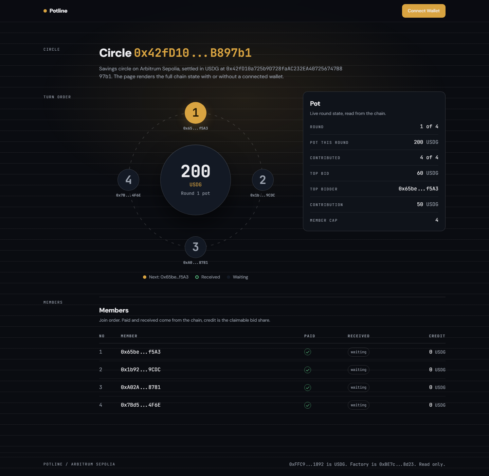

# Potline

Onchain group savings circles with a proper auction for early payout, settled in USDG on Arbitrum.

Live app: `PENDING_DEPLOY`
Contracts, both verified on Arbiscan: [PotlineFactory `0xBE7c…d23`](https://sepolia.arbiscan.io/address/0xBE7c2Ec0Fa8B4D0B6523bC3e8D3325409Fc78d23) and [demo SavingsCircle `0x42fD…7b1`](https://sepolia.arbiscan.io/address/0x42fD10a725b9D728faAC232EA407256747B897b1). Testnet, chain 421614.



---

## The instrument

A savings circle (arisan, paluwagan, tanda) is how most people outside Western credit systems build a buffer. A group pools a fixed amount every round and hands the entire pot to one member, in a rotating order. Everyone gets paid exactly once.

Informal circles work because the members trust each other. The bookkeeping does not work, because it is manual:

- Contributions live in a notebook. If someone pays and nobody writes it down, there is no dispute mechanism, only an argument.
- The turn order is whoever remembers.
- Nothing is enforced. A member who stops paying simply stops paying.

### The part everyone skips

Members sometimes need money before their turn comes. The group's informal answer is to sell that turn early: whoever offers most gets the pot now.

That is an auction, and it is the least formalized part of the whole instrument. No clearing price, no bidding window, no record of what each member is owed afterwards. The terms get negotiated at the exact moment somebody is already stressed about money.

Potline puts the auction onchain as a first class mechanic.

## How it works

1. Every member pays the same contribution into the pot, every round.
2. Once you have paid this round, you may bid part of the pot for the right to take it early. The highest standing bid wins.
3. The winning bid is split equally across the other members as claimable credit. The person taking the pot early pays for their own liquidity. Everyone else is made whole.
4. A round with no bid goes to the next member in join order who has not been paid. The pot rotates.
5. When every member has been paid once, the circle completes.

### Worked example

Four members, 50 USDG each, so the pot is 200 USDG. One member bids 60 USDG.

| Line | Amount |
|---|---|
| Pot this round | 200 USDG |
| Winning bid | 60 USDG |
| Taken by the bidder, minus their own bid | 140 USDG |
| Credit to each of the other 3 members (60 ÷ 3) | 20 USDG each |
| Total paid out | 140 + 60 = 200 USDG |

Nothing is created and nothing is lost. The bid is the price of liquidity, it is paid by the person who takes the money, and the rest of the group is made whole.

In the contract this is a two line branch. The rounding remainder stays with the winner, so the pot always balances to zero:

```solidity
uint256 share = others == 0 ? 0 : topBid / others;
payout = potThisRound - (share * others);
```

## Contracts

Two contracts, 234 lines total, both verified on Arbiscan.

| Contract | Address | Role |
|---|---|---|
| `PotlineFactory` | `0xBE7c2Ec0Fa8B4D0B6523bC3e8D3325409Fc78d23` | Deploys and indexes circles for one ERC20 |
| `SavingsCircle` (demo) | `0x42fD10a725b9D728faAC232EA407256747B897b1` | One seeded circle, 4 members, live state |
| USDG (testnet) | `0xFFC95faa3d63Cde504a05B567C600B78C0b41892` | 6 decimals, Arbitrum Sepolia |

`createCircle` is permissionless: no owner, no admin, no allowlist. Anyone can start a circle and anyone can join one.

The demo circle holds real onchain state: 4 members, a 200 USDG pot, 4 of 4 contributed this round, and a standing 60 USDG top bid. Settle it and the auction resolves in front of you.

### Safety decisions

These contracts hold other people's savings, so the money paths are deliberately boring:

- **Pull payments.** A settled payout is recorded, then withdrawn by its recipient. The contract never pushes tokens to a list of addresses it computed.
- **Reentrancy guard** on every state changing entry point.
- **Checks before effects, effects before interactions**, everywhere.
- **Immutable terms.** Token, contribution amount, and member cap are set at construction and cannot drift, so a circle cannot quietly raise what it charges or accept members past its cap.
- **Custom errors** instead of revert strings: cheaper, machine readable, and the app decodes them straight from the ABI.
- **No `tx.origin`, no `delegatecall`, no proxy, no upgrade path, no admin key.**

Member cap is 50, which keeps `settleRound` and the credit split cheap.

## Testing

22 Foundry tests, in memory, no network needed:

```shell
cd contracts
forge test -vv
```

The one that matters most is a fuzz test over bid amounts that runs a whole circle to completion and asserts the group as a whole pays in exactly what it receives, and that the contract holds zero at the end:

```solidity
assertEq(_sumMemberBalances(), sumBefore);      // nothing created or lost
assertEq(token.balanceOf(address(circle)), 0);  // nothing stranded
```

The rest cover the join and round state machine, bid and credit accounting, and a reentrancy test using a hostile token that reenters on every transfer, asserting the guard holds and the balance stays exact.

Conserving other people's money is the property you cannot eyeball, so it is fuzzed rather than assumed.

## Frontend

Next.js 16 App Router, TypeScript, Tailwind v4, shadcn style primitives, wagmi and viem for reads and wallet connection.

Every number on screen is read from the chain. No placeholder members, no invented activity, no fake counts.

- The **turn order wheel** is the signature element: members in join order, marking who has been paid and whose turn is next.
- **Actions are gated on real chain state.** A blocked action stays visible with the rule that blocks it (`Already paid this round`, `Round not full: 3 of 4 paid`), so a first time user can read the rules instead of wondering why a button is missing.
- **Reverts are decoded** from the ABI into messages naming the cause and the fix, including the number to beat on `BidTooLow`.
- **The contract has no getter** for whether a member paid this round, so the frontend recovers that from `Contributed` event logs filtered by round.

## Design

Dark, ledger inspired, brass on ink. Tokens in [`design-system/DESIGN.md`](design-system/DESIGN.md) are the source of truth for the implementation. Rendered previews are in [`design-system/screenshots/`](design-system/screenshots/).

## Repo

```
contracts/     Foundry: factory, circle, 22 tests, deploy script
web/           Next.js app: circle view, create, receipts
design-system/ Design tokens, previews, build screenshots
```

## Run locally

Contracts need Foundry, the app needs Node 20 or newer.

```shell
cd contracts
forge test -vv
cp .env.example .env      # RPC URL, deployer key, optional Arbiscan key
forge script script/Deploy.s.sol:DeployScript \
  --rpc-url "$ARB_SEPOLIA_RPC_URL" \
  --private-key "$PRIVATE_KEY" \
  --broadcast

cd ../web
npm install
npm run dev
```

`web/.env.example` documents one optional variable, an RPC override. Without it the app rotates across three public Arbitrum Sepolia endpoints.

## Limitations, honestly

- Testnet only, using a test USDG with no value.
- **The auction has no bidding deadline.** A member can outbid at the last moment. This is deliberate in a first version, and it is the clearest thing to add next: a commit reveal, so bids stay sealed until the round closes.
- **No backend and no indexer.** Circles are read live from the factory on each visit, so there is no search, no history view, and no notification when a round is ready to settle.
- **Public RPC endpoints are slow** and sometimes rate limited, which is why reads go through a fallback transport across three hosts.

## Licence

MIT for the contracts (see the SPDX headers). The frontend is submitted as a hackathon entry.